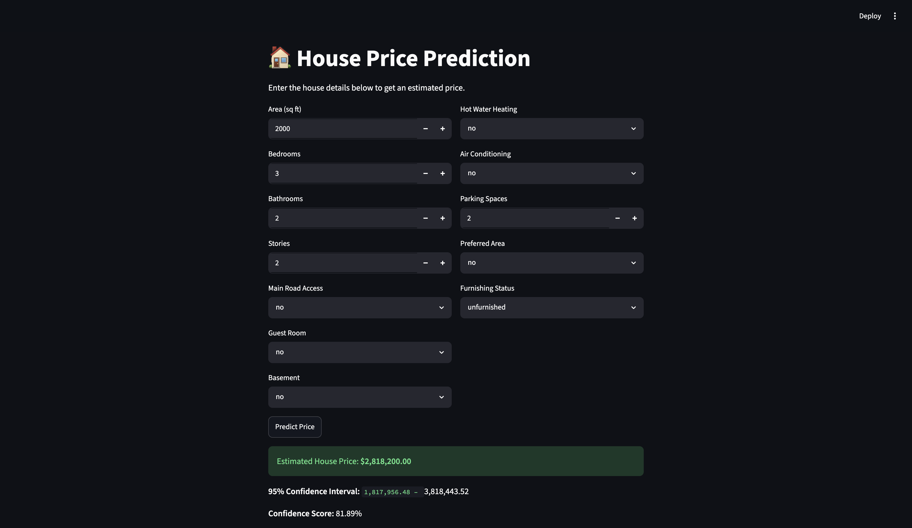
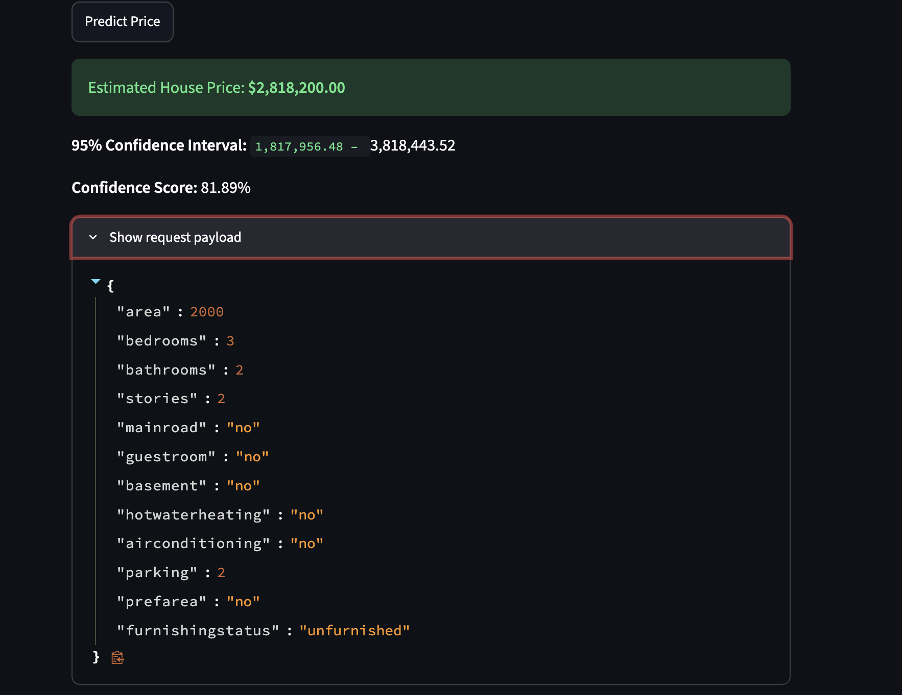
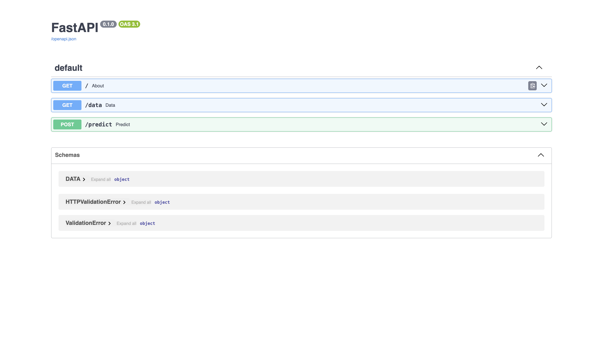

# House Price Prediction - FAML Assignment 9

End-to-end house price prediction system using machine learning, with a FastAPI backend and Streamlit frontend.

🔗 **Live Demo:** [https://end-to-end-house-price-prediction-tgen.onrender.com/](https://end-to-end-house-price-prediction-tgen.onrender.com/)

## Table of Contents

- [Project Structure](#project-structure)
- [Dataset](#dataset)
- [Approach](#approach)
- [Models Compared](#models-compared)
- [Running the Application](#running-the-application)
- [Running with Docker](#running-with-docker)
- [Deployment on Render](#deployment-on-render)
- [Screenshots](#screenshots)
- [Requirements](#requirements)

## Project Structure

```
├── Housing.csv                  # Dataset (545 records, 13 features)
├── backend/
│   └── main.py                  # FastAPI backend API
├── frontend/
│   └── app_fixed.py             # Streamlit frontend UI
├── model/
│   ├── house_price_model.pkl    # Trained RandomForestRegressor
│   └── feature_columns.pkl      # Feature columns used in training
├── notebooks/
│   └── model_try.ipynb          # EDA, feature engineering & model training
├── schema/
│   └── user_input.py            # Pydantic input schema for predictions
├── requirements.txt
├── Dockerfile                   # Docker image build
├── docker-compose.yml           # Multi-container orchestration
├── .dockerignore
└── objects/                     # Application screenshots
```

## Dataset

**Housing.csv** contains 545 records with the following features:

- **Numerical:** `area`, `bedrooms`, `bathrooms`, `stories`, `parking`
- **Categorical:** `mainroad`, `guestroom`, `basement`, `hotwaterheating`, `airconditioning`, `prefarea`, `furnishingstatus`
- **Target:** `price`

## Approach

1. **EDA** — Explored data distribution, identified numerical vs categorical columns, checked for missing values
2. **Feature Engineering** — Binary encoding (yes/no → 1/0), one-hot encoding (`furnishingstatus`), created `price_per_sqft` feature
3. **Model Training** — Compared Linear Regression vs Random Forest Regressor
4. **Model Selection** — Random Forest performed better (MAE: ~287k vs ~504k)

## Models Compared

| Model | MAE | MSE |
|---|---|---|
| Linear Regression | 504,031.78 | 587,217,091,347.07 |
| Random Forest | 287,866.14 | 327,229,666,131.63 |

Random Forest was selected and saved as `house_price_model.pkl`.

## Running the Application

Install dependencies from the project root:

```bash
pip install -r requirements.txt
```

### 1. Start the FastAPI backend

```bash
uvicorn backend.main:app --reload
```

API runs at `http://127.0.0.1:8000`. Endpoints:
- `GET /` — Health check
- `GET /data` — View dataset
- `POST /predict` — Predict house price (send JSON with house features)

### 2. Start the Streamlit frontend

```bash
streamlit run frontend/app_fixed.py
```

Opens a web UI to input house details and get predicted prices.

## Running with Docker

### Prerequisites

- Docker installed on your machine ([Get Docker](https://docs.docker.com/get-docker/))

### Build and run with docker-compose (recommended)

```bash
docker-compose up --build
```

This starts both services:
- **Backend** at `http://localhost:8000`
- **Frontend** at `http://localhost:8501`

### Run individual containers

```bash
# Build the image
docker build -t house-price-predictor .

# Backend only
docker run -p 8000:8000 house-price-predictor

# Frontend only (needs backend running separately)
docker run -p 8501:8501 -e API_URL=http://host.docker.internal:8000 house-price-predictor \
  streamlit run frontend/app_fixed.py --server.port 8501 --server.address 0.0.0.0
```

## Deployment on Render

The application is deployed on Render at:

[https://end-to-end-house-price-prediction-tgen.onrender.com/](https://end-to-end-house-price-prediction-tgen.onrender.com/)


## Screenshots

### Frontend



### Confidence Interval



### Project Structure


### FastAPI Documentation



## Requirements

- Python 3.10+
- Install all dependencies: `pip install -r requirements.txt`

